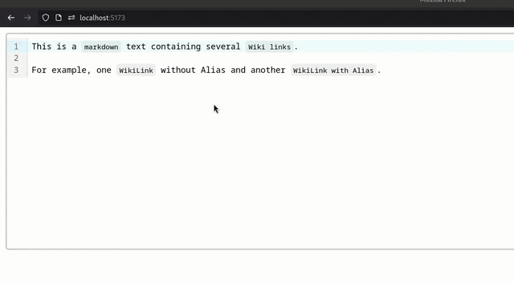

# Svelte, CodeMirror conceal POC

My note in french about this POC: https://notes.sklein.xyz/Projets/Projet-8

Proof Of Concept of a conceal feature for [CodeMirror](https://codemirror.net/) applied on a WikiLink Markdown syntax: `[[Page|alias]]`.

```sh
$ mise install
$ pnpm install
$ pnpm run dev
$ firefox http://localhost:5173/
```


